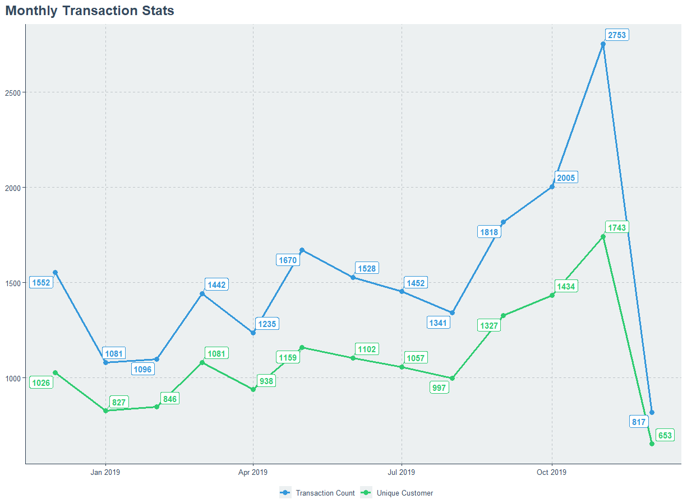
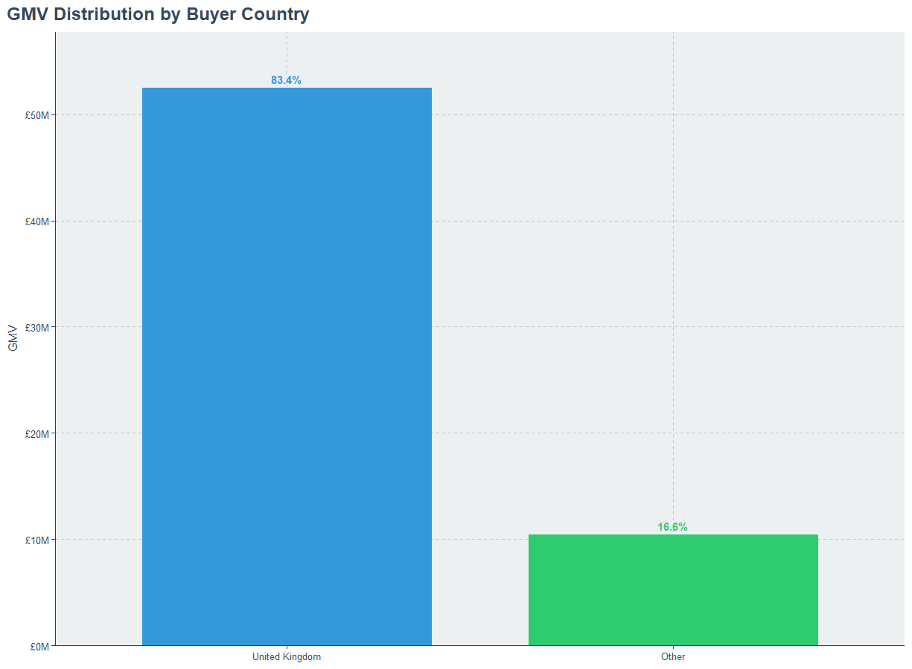
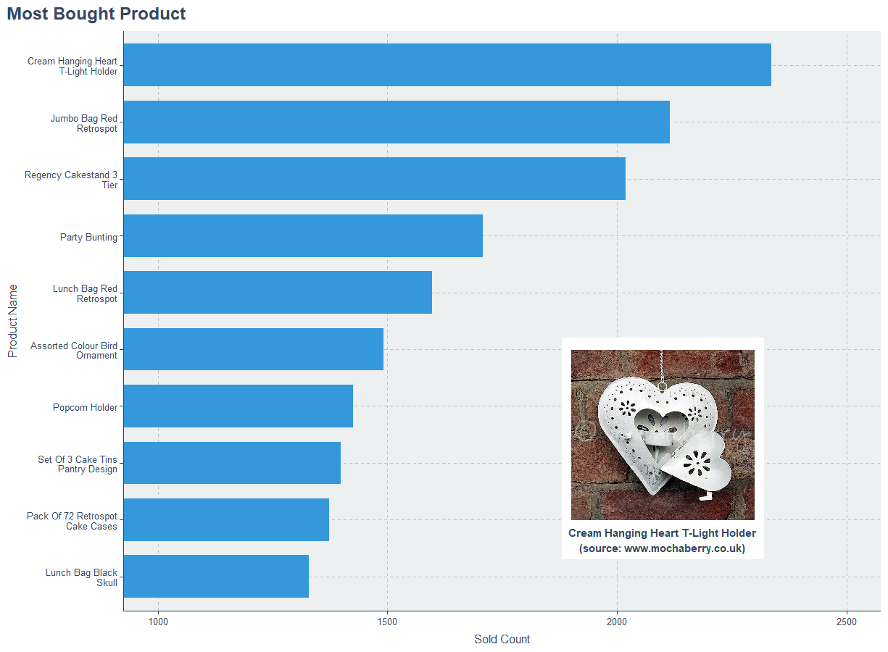

# From Data to Insight: Predicting E-Commerce Churn with Machine Learning


*Illustration asset by [Nathália Rosa](https://unsplash.com/@nathaliarosa?utm_source=unsplash&utm_medium=referral&utm_content=creditCopyText) on [Unsplash](https://unsplash.com/photos/rWMIbqmOxrY?utm_source=unsplash&utm_medium=referral&utm_content=creditCopyText)*

## Table of Content

* [What is Churn?](#what-is-churn)
* [Customer Churn Prediction](#customer-churn-prediction)
* [Objectives and Methodology](#objectives-and-methodology)
* [Main Analysis](#main-analysis)
    + [Data Collection](#data-collection)
    + [Data Exploration](#data-exploration)
    + [Data Pre-processing](#data-pre-processing)
    + [Random Forest Classification](#random-forest-classification)
* [Conclusions](#conclusions)
* [References](#references)

## What is Churn?

By literal definition from Cambridge dictionary:

> **Churn rate** (noun): *the percentage of customers who stop buying the products or services of a particular company, calculated for a particular period of time*

In the context of e-commerce businesses, the term “churn” refers to the state at which customers stop doing business with a company over a certain period of time. Churn rate is an important metric for e-commerce businesses because it can indicate many things such as the level of customer satisfaction, engagement, and loyalty. A high churn rate might indicate that customers are not satisfied with the products or services offered, or that they are finding better alternatives elsewhere.

## Customer Churn Prediction

Customer churn prediction analysis is a technique to forecast the likelihood that a customer will be lost from the business. The result is then used for improving marketing strategies. Studies show that the cost of developing a new customer is often higher than the cost of retaining an old customer [1]. Thus, retention of existing customers might have an impactful significance on the business. Customer churn prediction analysis is usually based on historical data that tracks customer behavior, such as purchase history. By analyzing this data, businesses can identify patterns that suggest a customer is at risk of churning.

With this analysis, businesses can prioritize their retention efforts and target customers who are at the highest risk of churning with tailored offers, incentives, or personalized communication to encourage them to stay with the business. The ultimate goal is to improve revenue and profitability by reducing customer churn rates and increasing customer retention.

## Objectives and Methodology

Several methods can be used for churn prediction analysis, from the simplest method such as logistic regression to advanced machine learning methods such as the artificial neural network. In this research, I want to test the predictive ability of machine learning algorithms applied to churn prediction. Random Forest, a common machine learning algorithm, will be used as the main method of prediction analysis. Random Forest is an ensemble algorithm that combines multiple decision trees to improve accuracy and reduce overfitting, while the decision tree itself is an algorithm to classify binary response variable. For the features, I will use customers’ products bought from their transaction records. Since this data is in text form, there will be pre-processing steps to transform them into good input. The output of this research will be a prediction model along with its performance evaluation using the confusion matrix table.

## Main Analysis

### Data Collection

The data for this research is a secondary dataset obtained from Kaggle. The title of the dataset is E-commerce Business Transaction. You can find the dataset [here](https://www.kaggle.com/datasets/gabrielramos87/an-online-shop-business). The data is about a sales transaction data set of UK-based e-commerce (online retail) for one year. Their customers come from all over the world and usually make direct purchases for themselves. There are also small businesses that buy in bulk and sell to other customers through retail outlet channels [2].

Here is a quick glimpse of the data:

```r
glimpse(trx_data)
#> Rows: 536,350
#> Columns: 8
#> $ TransactionNo <chr> "581482", "581475", "581475", "581475", "581475", "58147~
#> $ Date          <date> 2019-12-09, 2019-12-09, 2019-12-09, 2019-12-09, 2019-12~
#> $ ProductNo     <chr> "22485", "22596", "23235", "23272", "23239", "21705", "2~
#> $ ProductName   <chr> "Set Of 2 Wooden Market Crates", "Christmas Star Wish Li~
#> $ Price         <dbl> 21.47, 10.65, 11.53, 10.65, 11.94, 10.65, 11.53, 12.25, ~
#> $ Quantity      <int> 12, 36, 12, 12, 6, 24, 18, 12, 12, 24, 20, 12, 20, 12, 1~
#> $ CustomerNo    <int> 17490, 13069, 13069, 13069, 13069, 13069, 13069, 13069, ~
#> $ Country       <chr> "United Kingdom", "United Kingdom", "United Kingdom", "U~
```

### Data Exploration

For the rest of the analysis, I will use the **successful** transactions only. Based on the dataset description, canceled transactions can be distinguished by the letter “C” found in the transaction number.

<p align = "center">
  
  </br> <em> Monthly Transaction Statistics </em>
</p>

The highest transaction and customer count is on November 2019, and maybe even higher in the next month, but since the data is limited to the first week of December 2019, there is no such proof of the statement.

<p align = "center">
  
  </br> <em> GMV Distribution by Country </em>
</p>

A bold 83.4% of total market value is generated by domestic purchases, while the other 16.6% is from across the world. Most of the foreign sales are from Netherlands, Ireland, Germany, and France.

<p align = "center">
  
  </br> <em> Most Bought Product </em>
</p>

The most bought product is Cream Hanging Heart T-Light Holder which sold 2336 times during the entire year. I found a picture that might suitable for the product, the source is shown in the picture.

### Data Pre-processing

**Churn labeling**

The interest period is 3 months (roughly 90 days), and any customer who did not make any successful transaction is considered as churn. This does not include the new user who just did their first transaction in less than 3 months compared to the observed period (last date of the transaction recorded in the data).

```r
user_fm <- trx_data %>% 
  filter(Quantity > 0) %>% 
  group_by(CustomerNo) %>% 
  summarize(
    PurchaseFrequency = uniqueN(TransactionNo),
    TotalValue = sum(Price*Quantity)
  )

user_retention <- trx_data %>% 
  filter(Quantity > 0) %>% 
  group_by(CustomerNo) %>% 
  arrange(Date) %>% 
  summarize(
    FirstTrx = first(Date),
    LastTrx = last(Date)
  ) %>% 
  left_join(
    trx_data %>% 
      filter(Quantity > 0) %>% 
      group_by(CustomerNo) %>% 
      mutate(DateRank = frankv(Date, ties.method = "dense", order = -1)) %>% 
      filter(DateRank == 2) %>% 
      group_by(CustomerNo) %>% 
      summarize(SecondLastTrx = unique(Date)),
    by = "CustomerNo"
  ) %>% 
  mutate(
    SecondLastTrx = if_else(is.na(SecondLastTrx), FirstTrx, SecondLastTrx),
    LastObservedDate = max(trx_data$Date)
  ) %>% 
  relocate(LastTrx, .after = "SecondLastTrx") %>% 
  mutate(
    SecondLastDiff = LastTrx - SecondLastTrx,
    FirstLastObsDiff = LastObservedDate - FirstTrx
  )

user_churn <- user_fm %>% 
  left_join(user_retention, by = "CustomerNo") %>% 
  mutate(
    NewUser = if_else(FirstLastObsDiff <= 90, "yes", "no"),
    Churn = if_else((PurchaseFrequency == 1 & FirstLastObsDiff > 90) | 
                      (PurchaseFrequency > 1 & SecondLastDiff > 90), "yes", "no")
  )
```

**Text processing**

The main feature of this prediction analysis is the product bought. Since it is text-based, I need to transform them into meaningful features before the main analysis. To transform them, I will convert the text data into a corpus, then do some cleaning such as removing punctuations and stopwords, then the final step is to convert it into a sparse matrix.

```r
corpus_data <- Corpus(VectorSource(user_bought$ProductBought))
corpus_data <- tm_map(corpus_data, PlainTextDocument)
corpus_data <- tm_map(corpus_data, tolower)
corpus_data <- tm_map(corpus_data, textclean::replace_contraction)
corpus_data <- tm_map(corpus_data, function(x) {str_replace_all(x, "\\/", " ")})
corpus_data <- tm_map(corpus_data, removePunctuation)
corpus_data <- tm_map(corpus_data, stripWhitespace)
corpus_data <- tm_map(corpus_data, removeWords, stopwords("English"))
corpus_data <- tm_map(corpus_data, stemDocument)
dtm_data <- DocumentTermMatrix(corpus_data)
sparse_matrix <- removeSparseTerms(dtm_data, 0.995)
df_sparse <- as.data.frame(as.matrix(sparse_matrix))
colnames(df_sparse) <- make.names(colnames(df_sparse))
df_sparse$CustomerNo <- user_bought$CustomerNo
```

**Final features**

This step is to show how I combined the response variable and the predictor sparse matrix.

```r
feature_data <- user_churn %>% 
  filter(!is.na(CustomerNo)) %>% 
  filter(NewUser == "no") %>%
  transmute(CustomerNo, Churn = if_else(Churn == "yes", 1, 0)) %>% 
  left_join(df_sparse, by = "CustomerNo") %>% 
  column_to_rownames(var = "CustomerNo")
```

### Random Forest Classification

**Data splitting**

I split the data into training and testing data with a 80%:20% ratio respectively. 

```r
set.seed(1999)
sample_split <- sample.split(feature_data$Churn, SplitRatio = .8)
train_data <- subset(feature_data, sample_split == TRUE)
test_data <- subset(feature_data, sample_split == FALSE)
train_data$Churn = as.factor(train_data$Churn)
test_data$Churn = as.factor(test_data$Churn)
```

**Tuning the optimum parameter**

To find the optimum parameter (M) used in Random Forest, I used the Out-of-Bag error (OOB error) technique. The result is shown below.

```r
tuning_model <- tuneRF(train_data[,-1], train_data[,1], ntreeTry = 500)
tuning_model
```

Result:

```r
tuning_model
#>        mtry  OOBError
#> 19.OOB   19 0.2826300
#> 37.OOB   37 0.2679097
#> 74.OOB   74 0.2741250
```

**Final evaluation**

Using the result of the tuning step, the final prediction model was obtained. To evaluate this model, I use the accuracy metric from the confusion matrix table. Using the test data I mentioned earlier, the accuracy of the prediction is 74.21%. Although the number is relatively high, there is much room for improvement such as improving the false positive prediction rate.

```r
#> Confusion Matrix and Statistics
#> 
#>           Reference
#> Prediction   0   1
#>          0 292 112
#>          1  85 275
#>                                           
#>                Accuracy : 0.7421          
#>                  95% CI : (0.7096, 0.7728)
#>     No Information Rate : 0.5065          
#>     P-Value [Acc > NIR] : < 2e-16         
#>                                           
#>                   Kappa : 0.4847          
#>                                           
#>  Mcnemar's Test P-Value : 0.06397         
#>                                           
#>             Sensitivity : 0.7745          
#>             Specificity : 0.7106          
#>          Pos Pred Value : 0.7228          
#>          Neg Pred Value : 0.7639          
#>              Prevalence : 0.4935          
#>          Detection Rate : 0.3822          
#>    Detection Prevalence : 0.5288          
#>       Balanced Accuracy : 0.7426          
#>                                           
#>        'Positive' Class : 0               
#> 
```

## Conclusions

Churn rate is an important metric for e-commerce businesses. To improve revenue and profitability, businesses often do churn prediction analysis to improve their marketing strategies. In this research, I used customer transaction data from UK-based online e-commerce to test the predictive ability of the Random Forest classification method. What products the customers bought is used to determine whether they will churn or not. The result is 74.21% of prediction accuracy.

There are future research ideas that may improve this research’s result such as more precise text feature engineering and the use of various machine learning prediction methods to further verify the accuracy. Nonetheless, there are many reasons customers went churn, one of the reason is the presence of shipping fees. In e-commerce businesses, shipping fee is a crucial component of the transaction. There is a study shows that the shipping fee is likely to influence consumers’ online purchasing behavior and decision-making [3]. But, until then, save it for next time :)

> ***So, which type of e-commerce customer are you? :)***


## References

[1] X. Xiahou and Y. Harada, “B2C e-commerce customer churn prediction based on K-means and SVM,” *Journal of Theoretical and Applied Electronic Commerce Research*, vol. 17, no. 2, pp. 458–475, 2022. 

[2] Ramos G. (2022, April). E-commerce Business Transaction. Version 1. Retrieved March 20, 2023 from [https://www.kaggle.com/datasets/gabrielramos87/an-online-shop-business](https://www.kaggle.com/datasets/gabrielramos87/an-online-shop-business).

[3] M. Hadi and S. R. H. Hati, “Customer Churn Rate Analysis in Fashion E-Commerce Using Logistic Regression and Random Forest,” in *The 6th International Conference on Management in Emerging Markets (ICMEM 2021)*, 2021.
